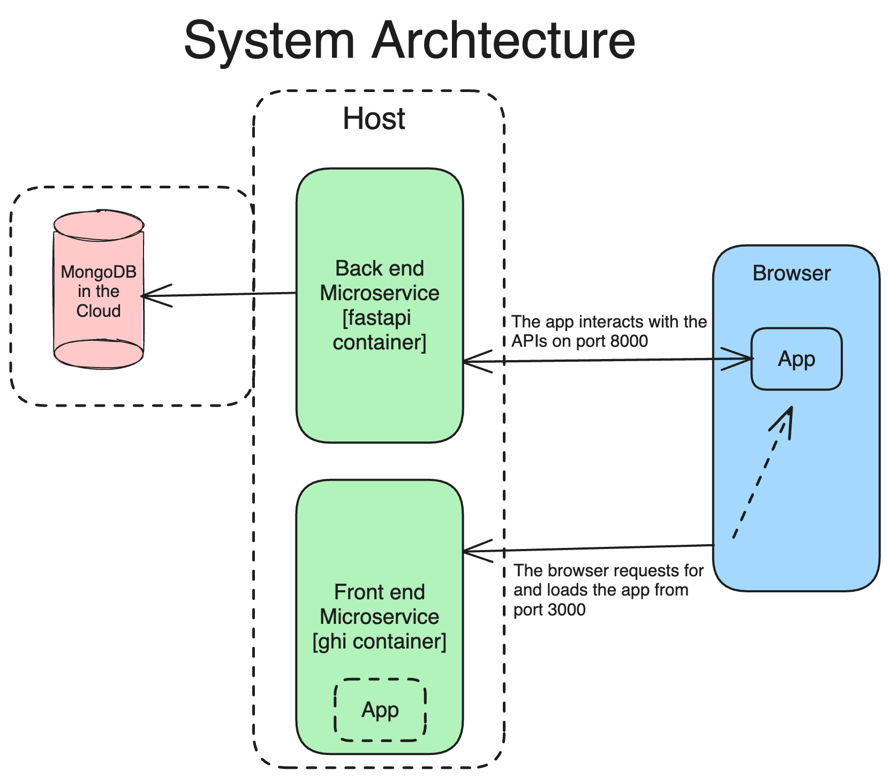

# Quantum Cup - A Unique Community of Coffee Enthusiasts
Quantum Cup is an app to connect coffee enthusiasts and coffee shops.

## Team
- Anthony
- Howard
- John
- Márcio

## Installation
This system is containerized and requires Docker to be installed on your host
system before proceeding with the installation. Here are the steps to follow:
- Download the source code from
  https://gitlab.com/TonySpence/quantum-cup/-/archive/main/quantum-cup-main.zip
- Decompress the image and navigate to the uncompressed directory.
- Copy the `.env.sample` file to `.env` and replace the values of the
  `DATABASE_URL` environment variables (see next step).
- Create an account at https://cloud.mongodb.com/, capture your password and
  connection string, and replace the value of the `DATABASE_URL` environment
  variable in the `.env` file with your connection string.
- Build and start the Docker images by running `docker-compose up`.
- Finally, open your browser and navigate to http://localhost:3000/ to access
  the application.

## System Design

### User Stories

The following user stories were used to design the system:

1. [ ] As a user, I want to be able to create a new account, either as a buyer or a vendor.
1. [ ] As a user, I want to be able to log in to the system, either as a buyer or a vendor.
1. [ ] As a user, I want to be able to log out of the system.
1. [ ] As a user, I want to be able to view and edit my account information.
1. [ ] As a buyer, I want to be able to view a list of all the coffee vendors in the system.
1. [ ] As a buyer, I want to be able to view the details of a coffee shop.
1. [ ] As a buyer, I want to be able to view a list of all the coffee products in the system.
1. [ ] As a buyer, I want to be able to view the details of a coffee product.
1. [ ] As a buyer, I want to be able to write a review for a coffee product.
1. [ ] As a buyer, I want to be able to write a review for a coffee shop.
1. [ ] As a buyer, I want to be able to order a coffee product.
1. [ ] As a buyer, I want to be able to view a list of all my orders.
1. [ ] As a buyer, I want to be able to view the details of an order.
1. [ ] As a buyer, I want to be able to cancel an order.
1. [ ] As a vendor, I want to be able to view a list of all the coffee products in the system.
1. [ ] As a vendor, I want to be able to view the details of a coffee product.
1. [ ] As a vendor, I want to be able to add a new coffee product.
1. [ ] As a vendor, I want to be able to edit a coffee product.
1. [ ] As a vendor, I want to be able to delete a coffee product.
1. [ ] As a vendor, I want to be able to view a list of all the orders in the system.
1. [ ] As a vendor, I want to be able to view the details of an order.
1. [ ] As a vendor, I want to be able to cancel an order.
1. [ ] As a vendor, I want to be able to mark an order as fulfilled.


### Architecture

The architecture of this system is composed of three subsystems, which are
directly reflected in the containers generated by the Docker image, except for
the database, hosted in the cloud. Below are each subsystem's descriptions and a
system architecture diagram.
- `Back end Microservice:` This subsystem provides all the data models. It
stores the information in the database and provides an API to access and process
the data.
- `Front end Microservice:` This subsystem provides the user interface. It is a
React app that is delivered to the browser when you access the host on port 3000.
- `The React App:` This is the front-end app that runs in the browser. It serves
as the user interface and interacts with the back-end microservice to provide a
seamless user experience.
- `The Database:` This subsystem is a MongoDB database that stores all the data
models. It is hosted in the cloud and is accessible through the back-end
microservice.

<br>




### The Data Model

The data model is composed of the following entities:

- `AccountIn:` This transitory entity represents a user signing up to the system.
Note that the username is a compound of the username and role ("john::buyer") to
ensure uniqueness in the two domains (buyer and vendor). The frontend app will
split the username and role into two separate attributes before showing it to
the user.
The AccountIn entity is composed of the following attributes:
    - `fullname:` The name of the user.
    - `email:` The email of the user.
    - `username:` A compound of the username and role ("john::buyer").
    - `password:` The password of the user.
    - `street:` The address of the user.
    - `city:` The city of the user.
    - `state:` The state of the user.
    - `zipcode:` The zip code of the user.
    - `phone:` The phone number of the user.
    - `role:` The role of the user. It can be either `buyer` or `vendor`.

- `AccountOutWithHashedPassword:` This entity represents either a buyer or a
vendor. It is used to store their information.
Note that the username is a compound of the username and role ("john::buyer") to
ensure uniqueness in the two domains (buyer and vendor). The frontend app will
split the username and role into two separate attributes before showing it to
the user.
This entity is composed of the following attributes:
    - `fullname:` The name of the user.
    - `email:` The email of the user.
    - `username:` A compound of the username and role ("john::buyer").
    - `street:` The address of the user.
    - `city:` The city of the user.
    - `state:` The state of the user.
    - `zipcode:` The zip code of the user.
    - `phone:` The phone number of the user.
    - `role:` The role of the user. It can be either `buyer` or `vendor`.
    - `hashed_password:` The hashed password of the user.

- `Product:` This entity represents a coffee product. It is used to store the
information of a coffee product. The product entity is composed of the following
attributes:
    - `name:` The name of the coffee product.
    - `description:` The description of the coffee product.
    - `price:` The price of the coffee product.
    - `unit`: The unit of the coffee product. It can be either `lb` or `oz`.
    - `image:` The image of the coffee product.
    - `vendor:` The vendor that sells the coffee product.

- `Order:` This entity represents an order. It is used to store the information
of an order. The order entity is composed of the following attributes:
    - `buyer:` The buyer that placed the order.
    - `vendor:` The vendor that received the order.
    - `product:` The product that was ordered.
    - `quantity:` The quantity of the product that was ordered.
    - `status:` The status of the order. It can be `pending`, `fulfilled`, or `canceled`.
    - `createdAt:` The date and time the order was created.

- `Review:` This entity represents a review. It is used to store the information
of a review. The review entity is composed of the following attributes:
    - `buyer:` The buyer that wrote the review.
    - `product:` The product that was reviewed.
    - `rating:` The rating of the review. It can be a number between 1 and 5.
    - `comment:` The comment of the review.
    - `createdAt:` The date and time the review was created.


## Accessing the Microservices

### FastAPI Microservice
The FastAPI microservice is accessible through http://hostURL:8000/api/.
The following endpoints are available:

#### Sign Up and Login Endpoints:

| Action                          | Method | URL                                          |
| --------------------------------| ------ | -------------------------------------------- |
| Sign up                         | POST   | /signup                                      |
| Login                           | POST   | /token                                       |
| Logout                          | DELETE | /token                                       |
| Get user token                  | GET    | /token                                       |

Example of signing up a new user:
```json
{
    "fullname": "Fred",
    "email": "Flintstone",
    "username": "fred::buyer",
    "password": "happycave",
    "role": "buyer",
    "street": "321 Rocky Way",
    "city": "Stoneville",
    "state": "CA",
    "zip": "95123",
    "phone": "(555) 543-5678",
}
```

Example of signing in a new user:
```json
{
    "username": "fred::buyer",
    "password": "happycave",
    "role": "buyer",
}
```

#### Vendors endpoints:
| Action                          | Method | URL                                          |
| --------------------------------| ------ | -------------------------------------------- |

#### Buyers endpoints:
| Action                          | Method | URL                                          |
| --------------------------------| ------ | -------------------------------------------- |

#### Products endpoints:
| Action                          | Method | URL                                          |
| --------------------------------| ------ | -------------------------------------------- |

#### Orders endpoints:
| Action                          | Method | URL                                          |
| --------------------------------| ------ | -------------------------------------------- |

#### Review endpoints:
| Action                          | Method | URL                                          |
| --------------------------------| ------ | -------------------------------------------- |
